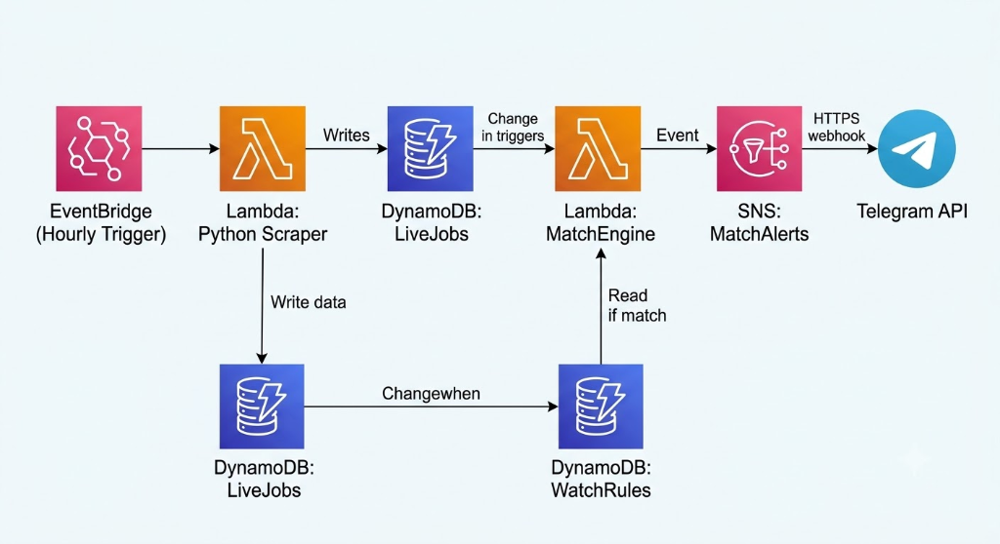

# JobPulse: Serverless Job Alerts

Have you ever seen the perfect job opening at your dream company, only to click 'Apply' and realize they already have 5,000 applicants? By the time a job hits LinkedIn, it's already too late.

JobPulse solves this problem. It is an ultra-fast, serverless job monitoring system that bypasses job boards completely. It scrapes the actual career pages of top tech companies and instantly pings your phone the second a new role drops.

## 🚀 Features

- **Instant Telegram Alerts**: Get notified within seconds of a job posting.
- **Advanced Filtering**: Filter by role (e.g., Frontend, Analyst), maximum experience, location, and specific companies.
- **Multi-Select Interface**: Seamlessly pick and choose which companies to monitor directly within the Telegram bot.
- **Live Search**: The bot instantly scans existing database jobs right after you configure your filters.
- **Sleek Web Interface**: Browse active jobs in real-time via a beautiful, dark-mode React frontend.

## 🏗️ Architecture

JobPulse is built on a robust, fully serverless AWS architecture:

1. **Amazon EventBridge**: Triggers the Scraper Lambda on an hourly schedule.
2. **Scraper Lambda (Python)**: Pulls live data from Lever and Greenhouse career pages (Spotify, Figma, Stripe, Zomato, etc.) and writes them to DynamoDB.
3. **Amazon DynamoDB**: Stores live jobs (\FirstMover-Jobs\) and user watch rules (\FirstMover-WatchRules\).
4. **MatchEngine Lambda**: Invoked whenever a new job is saved. It evaluates all user filters against the new job.
5. **Amazon SNS & Webhooks**: Instantly dispatches matching jobs via HTTP webhook directly to the Telegram API.
6. **Vercel Frontend**: A React + Vite web app polling the AWS API Gateway for the live feed of jobs.

## 🛠️ Tech Stack

- **Backend**: AWS Lambda, EventBridge, DynamoDB, API Gateway, Amazon SNS, Python (Boto3, Urllib)
- **Frontend**: React, Vite, TailwindCSS (glassmorphism UI), Vercel
- **Bot**: Telegram Bot API (pyTelegramBotAPI)

## 🛣️ Future Roadmap

- **AI Resume Matching**: Instead of strict keywords, upload your resume and let AI match you to scraped jobs.
- **Global Company Expansion**: Add Workday and Greenhouse parsers to scale to thousands of companies.
- **SMS Alert Integration**: For users who prefer SMS over Telegram notifications.

## 💡 How to Run Locally

1. Clone the repository.
2. Install Python requirements: pip install -r backend/requirements.txt
3. Start the Telegram Bot Listener: python backend/bot_listener.py
4. Start the frontend: cd frontend && npm install && npm run dev
5. *Optional*: Deploy the AWS SAM template using sam build && sam deploy.

---
*Built for the FirstMover Hackathon.*
