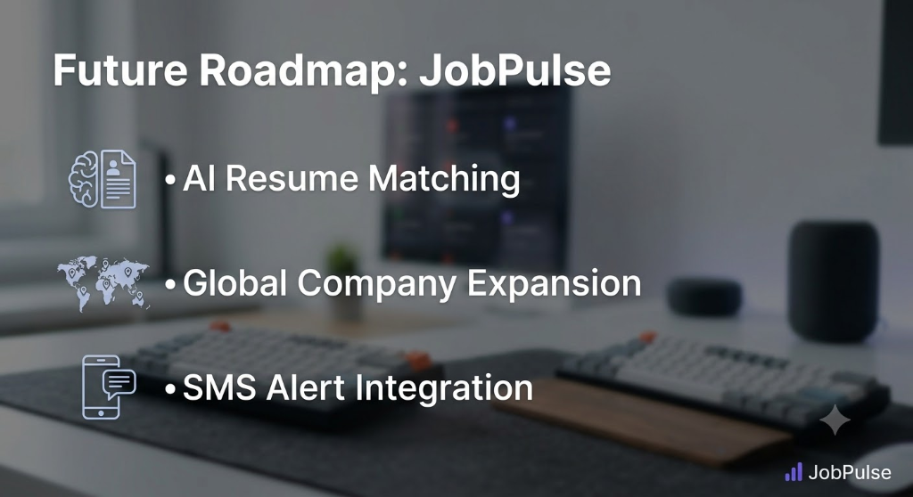

# JobPulse: Serverless Real-Time Job Alerts 🚀

Have you ever seen the perfect job opening at your dream company, only to click 'Apply' and realize they already have 5,000 applicants? By the time a job hits LinkedIn or Indeed, it's already too late.

**JobPulse** solves this problem. It is an ultra-fast, entirely serverless job monitoring system that bypasses traditional job boards completely. It scrapes the actual career pages of top tech companies and instantly pings your phone via Telegram the second a new role drops.

---

## 🤖 Try It Live! (Demo)

You don't need to install anything to see the magic. Try the live Telegram bot right now!

👉 **[Click here to chat with @jobpulse21bot](https://t.me/jobpulse21bot)** 👈

1. Open Telegram and send /start to the bot.
2. Enter your desired role (e.g., Frontend, Analyst, Python).
3. Set your maximum experience level to filter out senior roles.
4. Use our **Dynamic Multi-Select UI** to choose your preferred locations and cherry-pick the exact companies you want to monitor (Spotify, Stripe, Zomato, Figma, etc.).
5. Click **Finish & Save**.
6. The bot will instantly query the live database to show you existing jobs, and then it will remain on high alert to notify you the instant a new job is posted on AWS!

---

## 🏗️ Interactive Architecture

JobPulse is built on a highly scalable, robust AWS Serverless architecture designed for extreme speed and low latency.

`mermaid
graph TD
    %% AWS Event Source
    Cron[Amazon EventBridge Hourly Trigger] -->|Invokes| ScraperLambda

    %% Scraping & Ingestion
    subgraph "Data Ingestion Layer (AWS)"
        ScraperLambda[AWS Lambda: Python Scraper]
        ScraperLambda -->|Extracts HTML/JSON| Lever[Lever/Greenhouse APIs]
        ScraperLambda -->|Writes New Jobs| DynamoJobs[(DynamoDB: FirstMover-Jobs)]
    end

    %% Real-time Match Engine
    subgraph "Real-Time Processing Engine (AWS)"
        DynamoJobs -->|DynamoDB Streams / Event| MatchEngine[AWS Lambda: MatchEngine]
        MatchEngine -->|Reads User Rules| DynamoRules[(DynamoDB: FirstMover-WatchRules)]
        MatchEngine -.->|Evaluates Logic: Keyword + Exp + Loc| Decision{Is Match?}
    end

    %% Dispatch
    subgraph "Notification & Dispatch"
        Decision -->|Yes| SNS[Amazon SNS Topic]
        SNS -->|HTTPS Webhook| TelegramAPI((Telegram API))
        TelegramAPI -->|Instant Message| UserPhone📱
    end

    %% Frontend App
    subgraph "Web Application"
        Vercel[Vercel Frontend: React + Vite] -->|Polls Live Data| DynamoJobs
        Vercel -.-> UserWeb💻
    end

    %% Styles
    classDef aws fill:#FF9900,stroke:#232F3E,stroke-width:2px,color:#fff;
    classDef db fill:#3B48CC,stroke:#232F3E,stroke-width:2px,color:#fff;
    classDef bot fill:#24A1DE,stroke:#fff,stroke-width:2px,color:#fff;
    classDef frontend fill:#000,stroke:#fff,stroke-width:2px,color:#fff;
    
    class ScraperLambda,MatchEngine,SNS,Cron aws;
    class DynamoJobs,DynamoRules db;
    class TelegramAPI bot;
    class Vercel frontend;
`

*(Note: If the diagram above does not render, please see the static architecture diagram [here](assets/architecture.png))*

### How the Architecture Works:
1. **Amazon EventBridge**: Triggers the Python Scraper Lambda automatically on a strict schedule.
2. **Scraper Lambda**: Reaches out to the career portals of supported tech giants, parses the job data, and writes fresh job entries into the FirstMover-Jobs DynamoDB table.
3. **MatchEngine Lambda**: Operates completely asynchronously. Whenever a new job is written to the database, the MatchEngine is triggered. It scans the FirstMover-WatchRules DynamoDB table where all user Telegram filters are stored.
4. **Amazon SNS & Webhooks**: If the new job satisfies a user's exact criteria, an event is pushed through Amazon SNS and directly triggers a webhook to the Telegram API, instantly messaging the user.
5. **Vercel Frontend**: A sleek, dark-mode React application deployed on Vercel allows users to manually browse the live feed of AWS jobs in real-time.

---

## 🚀 Key Features

- **Sub-Second Telegram Alerts**: Get notified within seconds of a job being identified by the scraper.
- **Advanced Parameter Filtering**: Filter by role title, maximum years of experience, specific locations, and remote availability.
- **Multi-Select Company Interface**: Seamlessly pick and choose which companies to monitor using interactive Telegram inline keyboards.
- **Instant Backfill Search**: The moment you configure a filter, the bot instantly queries the live database to show you any currently active jobs that match.
- **Sleek Web Interface**: Browse active jobs manually via a highly optimized, glassmorphism-styled React frontend with zero-flicker background polling.

---

## 🛠️ Detailed Tech Stack

### Cloud & Backend ☁️
- **AWS Lambda**: Serverless compute for scraping and matching logic.
- **Amazon DynamoDB**: NoSQL database for lightning-fast job and user rule retrieval.
- **Amazon EventBridge**: Cron-based scheduling.
- **Amazon SNS**: Pub/Sub messaging for scalable notification dispatch.
- **Python 3.11**: Native urllib and oto3 used to bypass massive deployment dependencies.

### Frontend 💻
- **React.js & Vite**: Ultra-fast web app compilation and rendering.
- **TailwindCSS**: Beautiful, responsive, dark-mode utility styling.
- **Vercel**: Edge network deployment for the frontend application.

### Bot Platform 🤖
- **Telegram Bot API**: Leveraging pyTelegramBotAPI for interactive callback querying and state management.

---

## 🛣️ Future Roadmap

1. **AI Resume Matching**: Instead of relying on strict keyword filters, users will upload their PDF resumes. An LLM (Large Language Model) will evaluate scraped job descriptions against the resume and only trigger alerts for high-confidence matches.
2. **Global ATS Expansion**: Implement generic Workday, Greenhouse, and Ashby parsers to instantly scale the scraper to support thousands of tech companies.
3. **SMS Alert Integration**: Integrate AWS Pinpoint/SNS SMS to support users who prefer traditional text messages over Telegram.

---

## 💡 How to Run Locally

If you wish to host the Telegram listener and web app yourself:

1. Clone the repository.
2. Configure your .env file with your TELEGRAM_TOKEN and AWS Credentials.
3. Install Python requirements: 
   `ash
   pip install -r backend/requirements.txt
   `
4. Start the Telegram Bot Listener (Local Polling): 
   `ash
   python backend/bot_listener.py
   `
5. Start the frontend: 
   `ash
   cd frontend
   npm install
   npm run dev
   `
6. *Optional*: Deploy the AWS SAM template to your own AWS account using:
   `ash
   sam build
   sam deploy --guided
   `

---
*Built with ❤️ for the FirstMover Hackathon.*
